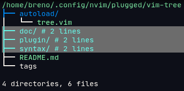
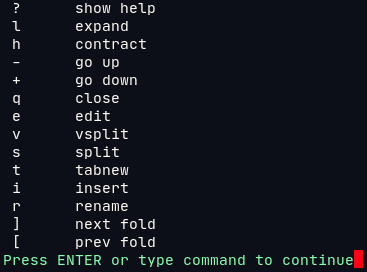

## vim-tree

This is a very basic "tree" command wrapper, with similar functionality to
Netrw. By calling :Tree the results of the tree command show in the buffer,
from where you can expand/collapse the tree, go down into a specific directory
or open/create/rename a file. 

```vim
    :Tree [directory]
    :GTree 
```



It also supports folds, so you can expand the tree and fold all (zM), opening
up only the branches of interest (zo / zO). 

You can open up help by pressing "?"



Some mappings are probided by default. You can define which keys you want
to map by overriding the g:vimtree_mappings variable.

```vim
    let g:vimtree_mappings = 
      \ [
      \   { 'key': '?', 'cmd': 'tree#help()',     'desc': 'show help' },
      \   { 'key': 'l', 'cmd': 'tree#expand()',   'desc': 'expand'    },
      \   { 'key': 'h', 'cmd': 'tree#contract()', 'desc': 'contract'  },
      \   { 'key': '-', 'cmd': 'tree#up()',       'desc': 'go up'     },
      ...
```
